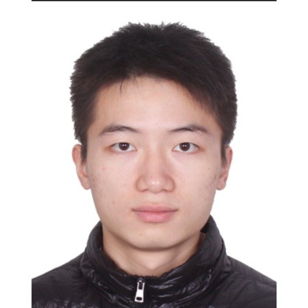

<head>

<!-- Google tag (gtag.js) -->

  <link href="https://fonts.googleapis.com/css?family=Google+Sans|Noto+Sans|Castoro"
        rel="stylesheet">

  <link rel="stylesheet" href="./static/css/bulma.min.css">
  <link rel="stylesheet" href="./static/css/bulma-carousel.min.css">
  <link rel="stylesheet" href="./static/css/bulma-slider.min.css">
  <link rel="stylesheet" href="./static/css/fontawesome.all.min.css">
  <link rel="stylesheet"
        href="https://cdn.jsdelivr.net/gh/jpswalsh/academicons@1/css/academicons.min.css">
  <link rel="stylesheet" href="./static/css/index.css">
  <link rel="icon" href="./static/images/favicon.svg">

  
  
  
  
  
</head>

**Abstract:**

<!-- Paper video. -->

      

        <h2 class="title is-4">Short Video Introduction</h2>
        

          <iframe src="https://www.youtube.com/embed/axCpZgNuP8U"
                  frameborder="0" allow="autoplay; encrypted-media" allowfullscreen></iframe>
        

      

## Paper &nbsp;&nbsp; &nbsp;&nbsp; [PDF]()&nbsp;&nbsp;•&nbsp;&nbsp; [CODE]() &nbsp;&nbsp;•&nbsp;&nbsp; [Poster]() &nbsp;&nbsp;•&nbsp;&nbsp;[Video]() &nbsp;&nbsp;•&nbsp;&nbsp;**ICRA 2023**

  

    
    

      <a href="https://haojhuang.github.io">Haojie Huang</a>
    

  

  

    
    

      <a href="https://pointw.github.io">Dian Wang</a>
    

  

  

    
    

      <a href="https://zxp-s-works.github.io/">Xupeng Zhu</a>
    

  

  

    
    

      <a href="http://mathserver.neu.edu/robin/">Robin Walters</a>
    

  

  

    
    

      <a href="http://www.ccs.neu.edu/home/rplatt/">Robert Platt</a>
    

  

&nbsp;&nbsp; &nbsp;&nbsp; &nbsp;&nbsp;&nbsp;&nbsp; &nbsp;&nbsp; &nbsp;&nbsp;&nbsp;&nbsp;  &nbsp;&nbsp;&nbsp;&nbsp;&nbsp;&nbsp;&nbsp;&nbsp; &nbsp;&nbsp; Khoury College of Computer Science, Northeastern University

## Introduction

## Contact

huang dot haoj @ northeastern dot edu
